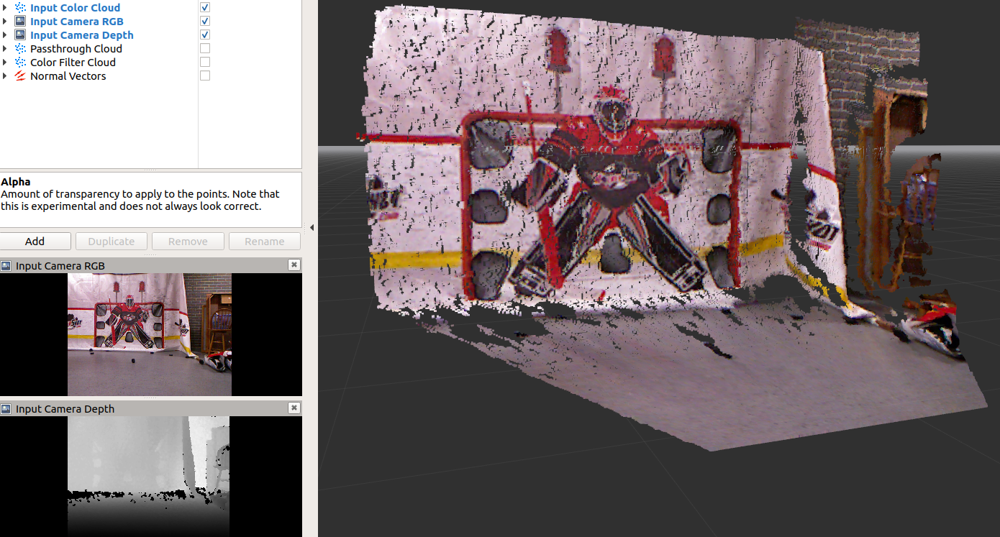

# Hockey Shot Goal Tracker - Xbox 360 kinect
##### Author: Ben Grudzien

## Overview 

+ This program uses the Xbox 360 Kinect to register how many goals I scored shooting pucks in my basement



## Links

+ Main tutorial (using freenect): https://answers.ros.org/question/196455/kinect-installation-and-setup-on-ros-updated/

+ Useage tutorial: http://wiki.ros.org/openni_launch/Tutorials/QuickStart

+ Latest version of OpenNI: http://wiki.ros.org/openni2_launch


## Instructions

+ First launch the driver

```
roslaunch hockey_shot kinect_driver.launch
```

+ Then, pick the bag launch file for bags, and the other for IRL Kinect

```
roslaunch hockey_shot hockey_shot.launch
```
```
roslaunch hockey_shot hockey_shot_bags.launch
```

+ If you chose the bag file launch file, ran the bag with this

```
rosbag play --clock solid_mix_best.bag -l
```

## Notes/ToDo

+ Verify depth data against lidar data by highlighting pointcloud in goal area

+ Could SLAM be used to localize where the goal points are? Then I wouldn't need to worry about where it is located

+ In rviz, you can select whether or not the pointcloud is overlayed on the camera output

+ Link to RGB field info PCL: https://answers.ros.org/question/57943/how-to-get-at-the-rgb-values-within-a-pclpointxyzrgb-cloud/ 

+ Rtab SLAM: https://www.hackster.io/dmitrywat/rgb-d-slam-with-kinect-on-raspberry-pi-4-ros-melodic-ace795 (source git = https://github.com/introlab/rtabmap/wiki/Tools#database-viewer)